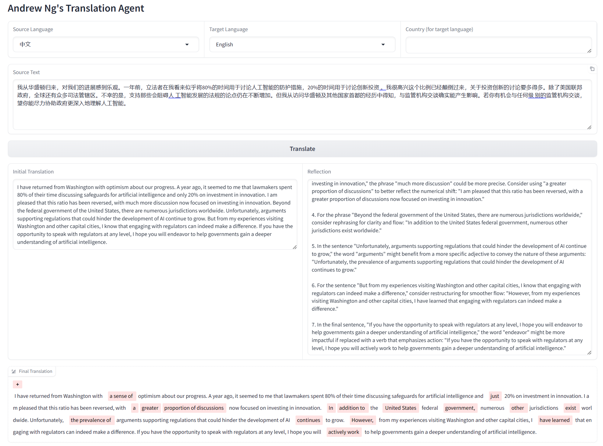
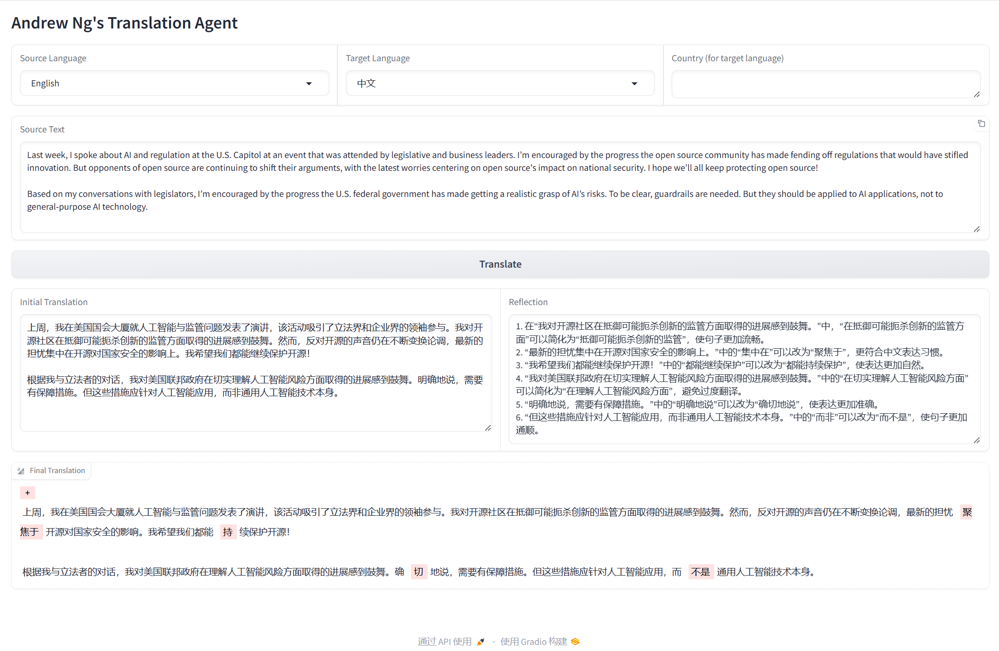

# Translation Agent UI: A UI for Andrew's Translation Agent

This is a gradio UI for Andrew Ng's [Translation Agent](https://github.com/andrewyng/translation-agent). The main features are:
1. Look inside the reflection agentic workflow during tranlation; 
2. Support other LLM models as translation engine; 
3. Highlight the differences between initial translation and final translation; 

Welcome to visit the demo website:  
https://huggingface.co/spaces/miaohaiyuan/translation-agent-UI




## Getting Started

To get started with `translation-agent-UI`, follow these steps:

### Installation:
- The Poetry package manager is required for installation. [Poetry Installation](https://python-poetry.org/docs/#installation) Depending on your environment, this might work:

```bash
pip install poetry 
```

- A .env file with a OPENAI_API_KEY is required to run the workflow. Please copy .env.sample to .env and modified the parameters. Following is an example to use deekseek LLM as a translation engine.  
OPENAI_API_KEY="sk-xxxx"  
OPENAI_BASE_URL="https://api.deepseek.com"  
OPENAI_MODEL = "deepseek-chat"  

- Clone the repo and install the dependencies:
```bash
git clone https://github.com/pisces76/translation-agent-UI
cd translation-agent
poetry install
poetry shell # activates virtual environment
```
### Usage:
```python
python app.py  
```
The web server will be running on local URL:  http://127.0.0.1:7860 by default.

You can still use the original function call to invoke tranlation_agent,  for example:
```python
import translation_agent as ta
source_lang, target_lang, country = "English", "Spanish", "Mexico"
translation = ta.translate(source_lang, target_lang, source_text, country)
```
See examples/example_script.py for an example script to try out.

## License

Translation Agent UI is released under the **MIT License**. You are free to use, modify, and distribute the code
for both commercial and non-commercial purposes.


